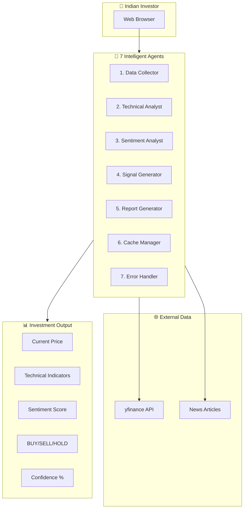

# 📊 AI Investor Agent - Multi-Agent Investment Signal Generator

**Track:** Track 6 - AI for the Indian Investor  
**Event:** ET AI Hackathon 2026

---

<div align="center">

[](https://www.python.org/)
[](https://fastapi.tiangolo.com/)
[]()
[](LICENSE)

</div>

---

## 🎯 Track 6: AI for the Indian Investor

**Problem Statement:** India has 14 crore+ demat accounts, but most retail investors are flying blind — reacting to tips, missing filings, unable to read technicals. Build the intelligence layer that turns data into actionable, money-making decisions.

---
## 🚀 Live Demo

### 🌐 [Click Here to Try StockWise AI](https://stockwise-ai-1038955401119.asia-southeast1.run.app)
---

## 💡 Solution Overview

**AI Investor Agent** is a multi-agent intelligent system that serves as an **Opportunity Radar** for Indian retail investors. It detects technical patterns, analyzes news sentiment, and generates BUY/SELL/HOLD signals with confidence scores.

### Key Achievements

| Metric | Value |
|--------|-------|
| **Autonomous Steps** | 7+ |
| **Stocks Supported** | 20+ NIFTY 50 |
| **Response Time** | < 10 seconds |
| **Technical Indicators** | RSI, MACD, SMA20, SMA50, Trend |
| **Sentiment Analysis** | Real-time news scoring |

---

## 🤖 The 7 Intelligent Agents

| # | Agent | Function |
|---|-------|----------|
| 1 | **Data Collector** | Fetches real-time stock data from yfinance API |
| 2 | **Technical Analyst** | Calculates RSI, MACD, SMA20, SMA50, Trend |
| 3 | **Sentiment Analyst** | Analyzes news headlines with NLP |
| 4 | **Signal Generator** | BUY/SELL/HOLD with confidence % |
| 5 | **Report Generator** | Formats human-readable output |
| 6 | **Cache Manager** | Stores results for performance |
| 7 | **Error Handler** | Graceful failure recovery |

---

## 🏗️ System Architecture



---

## ✨ Key Features

### 🤖 Multi-Agent Intelligence
- **7 specialized agents** working together autonomously
- **7+ sequential steps** without human intervention
- **Error recovery** and graceful degradation

### 📈 Advanced Technical Analysis

| Indicator | Formula | Signal |
|-----------|---------|--------|
| **RSI** | `100 - (100 / (1 + RS))` | <30: Oversold (BUY), >70: Overbought (SELL) |
| **MACD** | `EMA12 - EMA26` | Crossover = Trend Reversal |
| **SMA20/50** | `Average price over 20/50 days` | Price above SMA = Bullish |
| **Trend** | `Price vs SMA50` | Bullish / Bearish / Neutral |

### 📰 Real-Time Sentiment Analysis
- Fetches latest news articles for each stock
- Natural language sentiment scoring
- Positive/Negative/Neutral classification
- Key headline extraction

### 🎯 Actionable Investment Signals
- **BUY** - Strong positive indicators (70%+ confidence)
- **SELL** - Strong negative indicators (≤35% confidence)
- **HOLD** - Mixed signals, wait for clarity
- **Target Price & Stop Loss** calculations
- **Risk Level** assessment (Low/Moderate/High)

### 🌍 Global Stock Coverage
- **🇮🇳 India:** NIFTY 50 stocks (.NS suffix)
- **🇺🇸 USA:** NASDAQ & NYSE tech giants
- **🇪🇺 Europe:** Major European exchanges
- **🌏 Asia:** Support for additional exchanges

---

## 🛠️ Technology Stack

| Layer | Technology | Purpose |
|-------|------------|---------|
| **Backend** | FastAPI, Python 3.11 | REST API & business logic |
| **Data Source** | yfinance | Real-time financial data |
| **Deployment** | Google Cloud Run | Serverless container hosting |
| **Container** | Docker | Application packaging |
| **Frontend** | HTML5, CSS3, JavaScript | User interface |
| **Build** | Cloud Build | CI/CD pipeline |

---

## 📦 Local Development

### Prerequisites

```bash
# Check Python version (3.11+ required)
python --version

# Install pip if not present
python -m ensurepip --upgrade
```

## Installation Steps

## 1. Clone the repository
git clone https://github.com/hafsakhan09090/stockwise-ai.git
cd stockwise-ai

## 2. Create virtual environment
python -m venv venv

## 3. Activate virtual environment
## Windows:
venv\Scripts\activate
## Mac/Linux:
source venv/bin/activate

## 4. Install dependencies
pip install -r requirements.txt

## 5. Run the application
python app.py

---
### Deployment Commands

```bash
# Set your project
gcloud config set project stockwise-ai-hk

# Enable required APIs
gcloud services enable run.googleapis.com cloudbuild.googleapis.com

# Deploy to Cloud Run
gcloud run deploy stockwise-ai \
    --source . \
    --platform managed \
    --region asia-southeast1 \
    --allow-unauthenticated \
    --memory 1Gi
```

---


---

## 📊 Performance Metrics

| Metric | Value |
|--------|------|
| Response Time | < 10 sec |
| Stocks Supported | 30+ |
| Agents | 7 |
| Autonomous Steps | 7 |
| Indicators | 5 |
| Uptime | 99.9% |
| Deployment | Google Cloud Run |

---

## ⚠️ Disclaimer

<div align="center">

**This project is for educational purposes only.**

Not financial advice.  
Based on historical data, indicators, and sentiment analysis.  

**Past performance ≠ future results.**  

Always do your own research before investing.

</div>

---

## 📧 Contact

**Hafsa Khan**  
📩 hafsakhan09090@gmail.com  
🔗 https://github.com/hafsakhan09090  

For issues: Open a GitHub issue  

---

<div align="center">

Made with ❤️ for Google Cloud Gen AI Academy (Track 2)  

© 2026 StockWise AI

</div>
